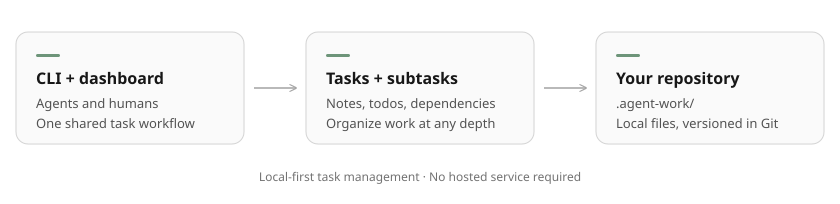

# SDS

[](https://www.typescriptlang.org/) [](https://bun.sh/) [](https://react.dev/) [](https://github.com/pumuckelo/sds/releases)

Local task management for agents and humans. Track work through the CLI or web dashboard, with tasks stored in `.agent-work/` alongside your code.



## Install

For macOS and Linux, on ARM64 or x64:

```sh
curl -fsSL https://github.com/pumuckelo/sds/releases/latest/download/install.sh | sh
```

Add `~/.local/bin` to your PATH. Run the same command to upgrade.

## Quick start

From the repository you want to track:

```sh
sds init
sds task create "Implement reset"
sds task list
sds task get TASK
```

To open the dashboard:

```sh
sds-dashboard
```

Visit [localhost:4317](http://127.0.0.1:4317/) to manage tasks, subtasks, dependencies, checklists and notes in a Kanban board or hierarchy. The CLI works without the dashboard running.

### Use with an agent

Give your agent the [setup instructions](skills/sds/references/setup.md) and ask it to install and use SDS in your repository. They cover installing the [SDS skill](skills/sds/SKILL.md) and adding project instructions so the agent uses it for future work.

## Working with tasks

```sh
sds todo add TASK "Endpoint" "Tests" --revision 1
sds todo complete TASK TODO1 TODO2 --revision 2
sds task stage TASK reviewing --revision 3
sds note add TASK "Verified token expiry" --revision 4
```

Use the latest revision returned by SDS. If another writer changed the task, reread it before retrying. IDs accept unambiguous prefixes of at least four characters.

### Subtasks and dependencies

Use todos for small steps and subtasks for work needing its own status or notes. Subtasks can nest recursively; two levels usually suffice.

```sh
sds task create "Implement backend" --parent TASK
sds task list --parent TASK --recursive
sds task move CHILD --parent TASK --revision 1
sds task move CHILD --root --revision 2
```

Link prerequisites in the dashboard or CLI:

```sh
sds task update TASK --revision N --json '{"operations":[{"type":"dependencies.set","dependencyIds":["OTHER_TASK"]}]}'
```

Parent, child and prerequisite statuses remain independent. Completing one does not automatically complete another.

### JSON and command discovery

Commands return JSON and accept complex input through `--json` or `--stdin`:

```sh
sds task create --json '{"title":"Reset flow","todos":[{"title":"Endpoint"},{"title":"Tests"}]}'
sds task get-many TASK1 TASK2
sds --help
sds schema update
sds schema update-many
```

Use `--verbose` for expanded mutation receipts. Multi-task updates report individual outcomes; they are not a single transaction.

## Projects and storage

The CLI finds the current project from your working directory. Use `--project /path/to/checkout` to select another.

Tasks live in `.agent-work/tasks/`, with project identity in `.agent-work/project.json`. Commit this directory to version tasks with your code. Commit the project identity before creating Git worktrees so they inherit it. Each checkout has its own task versions; concurrent edits across branches may need Git conflict resolution.

Machine-local registrations and locks live separately in `~/.local/state/sds`.

| Setting | Purpose |
| --- | --- |
| `SDS_PORT` | Dashboard port; default `4317`. |
| `SDS_STATE_DIR` | Registry and locks directory. Use the same value for CLI and dashboard. |
| `SDS_PROJECT` | Checkout to register at server startup. |

The dashboard is intended for local use and binds to loopback.

## Optional MCP

Start `sds-dashboard`, then connect your MCP client to `http://127.0.0.1:4317/mcp` using Streamable HTTP. It exposes the same task operations, with tool schemas available through the client.

## Contributing / Development

Requires Bun. From this repository:

```sh
bun install --frozen-lockfile
bun link
bun test
bun run typecheck
bun run build
bun run serve
```

For frontend development, run `bun run dev` in another terminal; Vite proxies requests to the server on port 4317. Disposable fixtures belong in the ignored `.sds-local/` directory.

Shared task operations live in `src/core/`; `src/cli/` and `src/server/` provide adapters. The dashboard lives in `src/App.tsx` and `src/components/`. Read [AGENTS.md](AGENTS.md) before contributing.

### Releases

From a clean, committed checkout on a branch:

```sh
bun run release
```

The helper creates and pushes a version tag with the branch, bumping and committing the patch version if the current version was already released from another commit. Set major, minor or prerelease versions manually. GitHub Actions builds and publishes the platform archives, dashboard, skills and installer. Separate steps are available as `bun run release:tag` and `bun run release:push`.

Installer sources are in `scripts/installer/`. Bundle them with `sh scripts/bundle-installer.sh > install.sh`; edit source modules rather than generated bundles.
